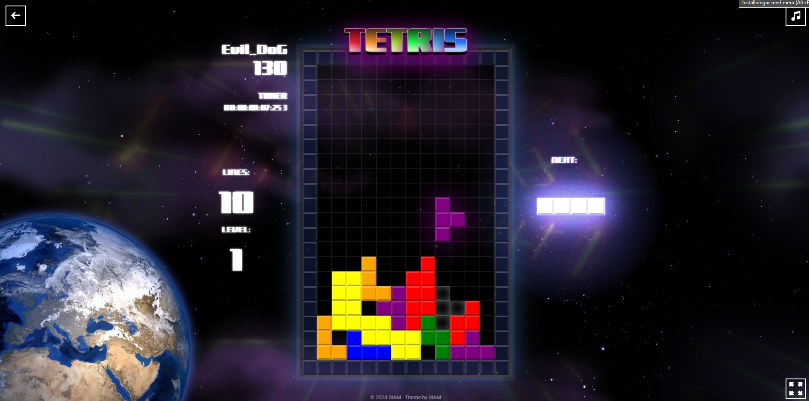

# Tetris Game

Tetris (Russian: Тетрис[a]) is a puzzle video game created in 1985 by Alexey Pajitnov, a Soviet software engineer.[1] It has been published by several companies for multiple platforms, most prominently during a dispute over the appropriation of the rights in the late 1980s. After a significant period of publication by Nintendo, in 1996 the rights reverted to Pajitnov, who co-founded the Tetris Company with Henk Rogers to manage licensing. - Wikipedia



## Features

-   Classic Tetris gameplay with intuitive fast controls.
-   Multiple levels of increasing difficulty to challenge players.
-   Fast down functionality to drop your tetronome in place.
-   Multiplier score, per each line.
-   Responsive design for playability across different devices, including mobile phones.
-   Sound and color match the stage for an immersive experience.
-   Storing highscore and alias in database.

## Getting Started

Follow these instructions to get a copy of the project up and running on your local machine for development and testing purposes.

### Prerequisites

-   Node.js installed on your machine
-   npm package manager
-   Vite installed globally

### Installation

1. Clone the repository:

```bash
git clone https://github.com/diamdesign/tetris
```

2. Navigate to the project directory:

```bash
cd .\tetris\game\
```

3. Install dependencies:

```bash
npm install
```

4. Run development server:

```bash
npm run dev
```

### Building for Production

To build the project for production, run:

```bash
vite build
```

This will create an optimized build of the game in the dist directory.

## Credits

This was a project made during Lexicon React course 2024. The game was made
during the first week of two.

<strong>Music and sound effects</strong> are from Pixabay.com

## Created by

Fredrik Berglund
